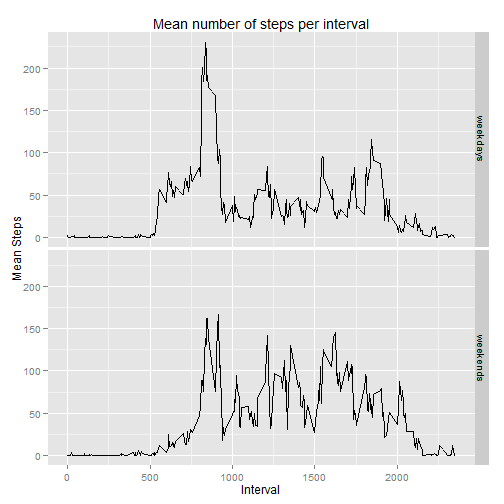

Reproducible Research : Assignment #1
========================================================

Code to unzip and read the activity data set. Also converting the date variable from the default factor to a date class will be helpful later.


```r
unzip('activity.zip')
activity <- read.csv('activity.csv')
activity$date <- as.Date(activity$date)
```

Question #1: What is mean total number of steps taken per day?

To address this we first sum the steps taken in each interval for a given day. Then we plot this data as a histogram to assess the distribution of the data. The mean and median are calculated and are 10766.19 and 10765, respectively. 


```r
daily.steps <- with(activity, tapply(steps,date,sum))
hist(daily.steps, main = 'Steps taken per day', xlab = 'Daily Steps')
```

 

```r
mean.steps <- mean(daily.steps, na.rm = TRUE)
median.steps <- median(daily.steps, na.rm=TRUE)
mean.steps
```

```
## [1] 10766
```

```r
median.steps
```

```
## [1] 10765
```

Question #2: What is the average daily activity pattern?

To address this question, we take the mean per interval for all of the days. Next, we generate a plot by plotting the mean steps at each interval. To determine the interval with the greatest mean activity, we can utilize the which.max function to get the row and then display the row. This shows that the maximum value is at interval 835, representing 8:35, with a mean value of 206.17.


```r
library(ggplot2)
activity.intervals <- with(activity, tapply(steps,interval,mean, na.rm=TRUE))

activity.intervals <- data.frame(interval = as.numeric(rownames(activity.intervals)),mean.steps = activity.intervals)

ggplot(activity.intervals, aes(interval, mean.steps)) + geom_line() + ggtitle('Mean number of steps per interval') +
  xlab('Interval') + ylab('Mean Steps') 
```

 

```r
activity.intervals[which.max(activity.intervals$mean.steps),]
```

```
##     interval mean.steps
## 835      835      206.2
```

Question #3: Imputing missing values

Using the summary function, we can see that the data contains 2304 NA values in the steps column. By subsetting the NAs into a new data frame and using the table function, we can see that the NAs occur on 6 specific days with 288 NAs on each day. Therefore the simplest approach is to impute the data for each interval is by using the mean for the interval over the whole duration that the data was collected. After we impute the data, we call the summary function again to see the missing values are no longer there.


```r
summary(activity)
```

```
##      steps            date               interval   
##  Min.   :  0.0   Min.   :2012-10-01   Min.   :   0  
##  1st Qu.:  0.0   1st Qu.:2012-10-16   1st Qu.: 589  
##  Median :  0.0   Median :2012-10-31   Median :1178  
##  Mean   : 37.4   Mean   :2012-10-31   Mean   :1178  
##  3rd Qu.: 12.0   3rd Qu.:2012-11-15   3rd Qu.:1766  
##  Max.   :806.0   Max.   :2012-11-30   Max.   :2355  
##  NA's   :2304
```

```r
NAs <- activity[is.na(activity$steps),]
table(NAs$date)
```

```
## 
## 2012-10-01 2012-10-08 2012-11-01 2012-11-04 2012-11-09 2012-11-10 
##        288        288        288        288        288        288 
## 2012-11-14 2012-11-30 
##        288        288
```

```r
for(i in 1:nrow(activity)) {
  if (is.na(activity$steps[i])) activity$steps[i] <- activity.intervals$mean.steps[match(activity$interval[i],activity.intervals$interval)]
  
}

summary(activity)
```

```
##      steps            date               interval   
##  Min.   :  0.0   Min.   :2012-10-01   Min.   :   0  
##  1st Qu.:  0.0   1st Qu.:2012-10-16   1st Qu.: 589  
##  Median :  0.0   Median :2012-10-31   Median :1178  
##  Mean   : 37.4   Mean   :2012-10-31   Mean   :1178  
##  3rd Qu.: 27.0   3rd Qu.:2012-11-15   3rd Qu.:1766  
##  Max.   :806.0   Max.   :2012-11-30   Max.   :2355
```

```r
daily.steps <- with(activity, tapply(steps,date,sum))
hist(daily.steps, main = 'Steps taken per day', xlab = 'Daily Steps')
```

 

```r
mean.steps <- mean(daily.steps, na.rm = TRUE)
median.steps <- median(daily.steps, na.rm=TRUE)
mean.steps
```

```
## [1] 10766
```

```r
median.steps
```

```
## [1] 10766
```
After imputing the data, we reanalyze the data as in the previous question. As we can observe, there is almost no change in the mean or median. This is because we utilized the mean to impute the days with 'steps' missing and therefore the only change is that there are a few more days with an "average" number of steps taken per day.


Question #4: Are there differences in activity patterns between weekdays and weekends?

```r
library(knitr)
library(reshape2)

activity$day <- weekdays(activity$date)
activity$day <- as.factor(activity$day)

activity$is.weekday <- !(activity$day == 'Sunday' | activity$day == 'Saturday')

activity.weekdays <- subset(activity, activity$is.weekday==TRUE)
activity.weekends <- subset(activity, activity$is.weekday==FALSE)

table(activity.weekdays$day)
```

```
## 
##    Friday    Monday  Saturday    Sunday  Thursday   Tuesday Wednesday 
##      2592      2592         0         0      2592      2592      2592
```

```r
table(activity.weekends$day)
```

```
## 
##    Friday    Monday  Saturday    Sunday  Thursday   Tuesday Wednesday 
##         0         0      2304      2304         0         0         0
```

```r
weekdays <- with(activity.weekdays, tapply(steps,interval,mean, na.rm=TRUE))
weekends <- with(activity.weekends, tapply(steps,interval,mean, na.rm=TRUE))

activity.compairison <- cbind(weekdays = weekdays, weekends = weekends)
activity.compairison <- as.data.frame(activity.compairison)

activity.compairison$interval <- rownames(activity.compairison)

activity.melt <- melt(activity.compairison, id.vars = 'interval')

activity.melt$interval <- as.numeric(activity.melt$interval)


ggplot(activity.melt, aes(interval,value)) + geom_line() + ggtitle('Mean number of steps per interval') +
  xlab('Interval') + ylab('Mean Steps') + facet_grid(variable ~ .)
```

 

knit2html('PA1_template.Rmd')
